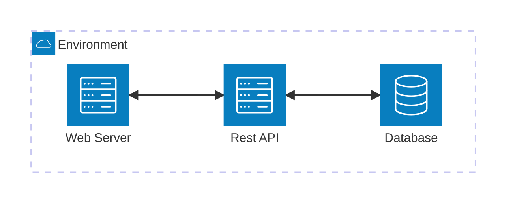

Identity Management System

A basic identity management system with pre-existing credentials, that handles user authentication.

# functional requirements
* Users can authenticate using valid credentials.
* Only authenticated users can access protected pages (including via direct URL access).
* Users can log out and terminate their authenticated session.
* The system returns a generic error message for authentication failures. 
* Authenticated session persist across page refreshes.
* Session expires after 5 minutes.

# non-functional requirements
* The system must securely store user credentials.
* Stored credentials must be non-revesible.
* The system must prevent credential disclosure in error messages.
* The system must enforce session expiration and invalidation.

# System Diagram

